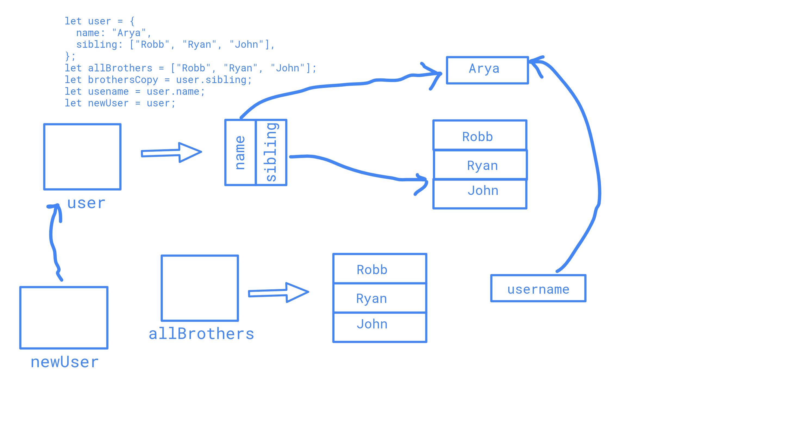

```js
let user = {
  name: "Arya",
  sibling: ["Robb", "Ryan", "John"],
};
let allBrothers = ["Robb", "Ryan", "John"];
let brothersCopy = user.sibling;
let usename = user.name;
let newUser = user;
```

1. Memory representation

- Create the memory representation of the above snippet on notebook.
- Take a photo/screenshot and add it to the folder `code`



2. Answer the following with reason:

- `user == newUser;` // true - as the value of user is been stored in newUser.
- `user === newUser;` // true - as the value of user is been stored in newUser.
- `user.name === newUser.name;` // true - as the value of user.name and newUser.name is same.
- `user.name == newUser.name;` // true - as the value of user.name and newUser.name is same.
- `user.sibling == newUser.sibling;` // true - as the value of user.sibling and newUser.sibling is same.
- `user.sibling === newUser.sibling;` // true - as the value of user.sibling and newUser.sibling is same.
- `user.sibling == allBrothers;` // false - as they point towards different memory location.
- `user.sibling === allBrothers;` // false - as they point towards different memory location.
- `brothersCopy === allBrothers;` // false - as they point towards different memory location.
- `brothersCopy == allBrothers;` // false - as they point towards different memory location.
- `brothersCopy == user.sibling;` // true - as the value of brothersCopy and user.sibling is same.
- `brothersCopy === user.sibling;` // true - as the value of brothersCopy and user.sibling is same.
- `brothersCopy[0] === user.sibling[0];` // true - as the value of brothersCopy and user.sibling is same.
- `brothersCopy[1] === user.sibling[1];` // true - as the value of brothersCopy and user.sibling is same.
- `user.sibling[1] === newUser.sibling[1];` // true - as the value of brothersCopy and user.sibling is same.
